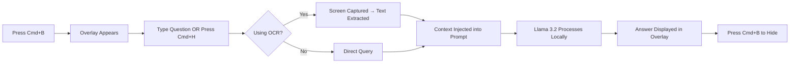

# 👻 GhostOverlay

> **The Invisible, Privacy-First AI Assistant for Professionals**  
> *Local Llama 3.2 Intelligence • Zero Cloud Dependency • Completely Undetectable*

<div align="center">

[](https://opensource.org/licenses/MIT)
[](https://www.apple.com/mac/)
[](https://github.com/Utkarsh-Karambhe/ghostoverlay)
[](https://nodejs.org/)
[](https://ollama.ai/)

[Features](#-key-features) • [Installation](#%EF%B8%8F-installation--setup) • [Usage](#-usage) • [Use Cases](#-real-world-use-cases) • [Roadmap](#-roadmap) • [Contributing](#-contributing)

</div>

---

## 🎯 What is GhostOverlay?

**GhostOverlay** is a high-performance, local AI assistant engineered for professionals who demand **discreet, context-aware intelligence** without compromising privacy. Built exclusively for Apple Silicon (M1/M2/M3), it harnesses **Llama 3.2** to deliver instant, grounded answers based on your screen content—entirely offline.

### Why GhostOverlay?

Unlike cloud-based assistants, GhostOverlay features **Stealth Mode**—an advanced rendering technique that makes it **invisible to screen-sharing software** (Zoom, Teams, Meet, Slack). Perfect for:

- 🎤 **Live presentations** where you need instant facts without audience distraction
- 💻 **Technical interviews** requiring discreet analysis of coding problems
- 📊 **Client meetings** where professionalism demands seamless assistance
- 🔒 **Sensitive work** in environments with strict data compliance requirements

---

## ✨ Key Features

### 🧠 **Local-First Intelligence**

| Feature | Description |
|---------|-------------|
| **Llama 3.2 Power** | Runs entirely on-device using Ollama. Zero latency, zero data leakage |
| **100% Offline** | No internet required. Your data never leaves your machine |
| **Optimized Performance** | Tuned for lightweight systems (tested on MacBook Air M2, 8GB RAM) |
| **Apple Silicon Native** | Metal acceleration for maximum efficiency |

### ⚡ **Frictionless Workflow**

```
Cmd + B        →  Toggle assistant overlay (instant show/hide)
Cmd + H        →  Full-screen OCR + auto-inject context
Drag selection →  Region of Interest (ROI) for focused extraction
```

- **Global Hotkeys:** System-wide access from any application
- **Context-Aware OCR:** Intelligent text extraction with preprocessing
- **Smart Prompting:** Auto-injects screen context for grounded AI responses
- **Region Selection:** Drag to capture specific UI elements, charts, or code blocks

### 🕵️‍♂️ **Stealth & Privacy Architecture**

<table>
<tr>
<td width="50%">

**Invisible by Design**
- Protected system layer rendering
- Excluded from screen-sharing APIs
- Screenshot-proof overlay
- No window chrome or visible borders

</td>
<td width="50%">

**Privacy Guarantees**
- Zero telemetry or analytics
- All processing happens locally
- No network requests (verifiable)
- GDPR/CCPA compliant by design

</td>
</tr>
</table>

---

## 💡 Real-World Use Cases

| Scenario | Challenge | GhostOverlay Solution |
|----------|-----------|----------------------|
| **📢 Live Presentations** | Need facts/stats without breaking flow | Overlay invisible to audience; get instant answers via `Cmd+H` |
| **👨‍💻 Technical Interviews** | Screen-shared coding challenges | Analyze problems/hints discreetly while maintaining professional appearance |
| **🎓 Virtual Learning** | Complex documentation during tutoring sessions | Extract and query specific sections without disrupting student view |
| **🔐 Compliance Work** | Can't use cloud AI due to data policies | 100% local processing ensures regulatory compliance |
| **📊 Client Demos** | Fielding unexpected technical questions | Instant fact-checking without searching visibly |

---

## 🛠️ Installation & Setup

### Prerequisites

Ensure you have the following installed:

- **macOS** (Monterey 12.0 or later)
- **Apple Silicon** (M1/M2/M3/M4)
- **Node.js** 18+ ([Download](https://nodejs.org/))
- **Ollama** ([Install Guide](https://ollama.ai/))

### Quick Start

```bash
# 1. Clone the repository
git clone https://github.com/Utkarsh-Karambhe/ghostoverlay.git
cd ghostoverlay

# 2. Install dependencies
npm install

# 3. Pull Llama 3.2 model (if not already installed)
ollama pull llama3.2

# 4. Start GhostOverlay
npm start
```

### First Launch Configuration

1. **Grant Screen Recording Permissions**  
   `System Settings` → `Privacy & Security` → `Screen Recording` → Enable for GhostOverlay

2. **Verify Ollama Service**  
   ```bash
   # Check if Ollama is running
   curl http://localhost:11434/api/tags
   ```

3. **Test Hotkeys**  
   - Press `Cmd + B` to toggle overlay visibility
   - Press `Cmd + H` to capture screen and auto-prompt

---

## 🎮 Usage

### Basic Workflow



### Advanced Features

#### 📐 Region of Interest (ROI) Selection

1. Press `Cmd + H`
2. Click and drag to select specific screen area
3. Only selected region is processed (reduces noise, improves accuracy)

#### 🎯 Context-Aware Prompting

```javascript
// Example: Analyzing code during interview
Screen Context (auto-extracted): "function fibonacci(n) { ... }"
Your Query: "What's the time complexity?"
AI Response: "O(2^n) in this recursive implementation. Consider dynamic programming for O(n)."
```

### Customization

Edit `config.json` to modify:

```json
{
  "hotkeys": {
    "toggle": "CommandOrControl+B",
    "capture": "CommandOrControl+H"
  },
  "model": "llama3.2",
  "maxTokens": 512,
  "temperature": 0.7,
  "stealthMode": true
}
```

---

## 🏗️ Technical Architecture

```
┌─────────────────────────────────────────┐
│         Electron Main Process           │
│  ┌───────────────────────────────────┐  │
│  │   Global Hotkey Registration      │  │
│  │   Screen Capture (node-screenshots)│  │
│  │   OCR Processing (Tesseract.js)   │  │
│  └───────────────────────────────────┘  │
└─────────────────┬───────────────────────┘
                  │
        ┌─────────▼──────────┐
        │  Overlay Renderer  │
        │  (Frameless +      │
        │   Always-on-Top)   │
        └─────────┬──────────┘
                  │
        ┌─────────▼──────────┐
        │   Ollama API       │
        │   (localhost:11434)│
        │   Llama 3.2        │
        └────────────────────┘
```

### Stealth Implementation

GhostOverlay achieves invisibility through:

1. **Frameless Windows:** No OS chrome or title bars
2. **Protected Content Flag:** Marks window as screen-capture-resistant
3. **Layer Manipulation:** Renders above screen-sharing capture layers
4. **Transparent Overlay:** Only UI elements visible to user

---

## 🔮 Roadmap

### Planned Features

- [ ] **Dynamic Model Switching** — Toggle between `llama3.2`, `codellama`, `mistral`
- [ ] **Voice Input** — Local Whisper integration for hands-free queries
- [ ] **Meeting Intelligence** — Offline transcription + action item extraction
- [ ] **Multi-Monitor Support** — Independent overlays per display
- [ ] **Plugin System** — Custom OCR processors and response formatters
- [ ] **Encrypted Data Vault** — Local storage for conversation history

### Experimental

- [ ] **Gesture Controls** — Trackpad gestures for ROI selection
- [ ] **Contextual Memory** — Session-based context retention
- [ ] **Auto-Translation** — Multilingual OCR and responses

---

## 🤝 Contributing

We welcome contributions! Here's how to get involved:

### Reporting Issues

Found a bug or have a feature request? [Open an issue](https://github.com/Utkarsh-Karambhe/ghostoverlay/issues) with:

- macOS version and hardware specs
- Steps to reproduce (if bug)
- Expected vs. actual behavior
- Screenshots (if applicable)

### Pull Requests

1. Fork the repository
2. Create a feature branch (`git checkout -b feature/amazing-feature`)
3. Commit changes (`git commit -m 'Add amazing feature'`)
4. Push to branch (`git push origin feature/amazing-feature`)
5. Open a Pull Request

**Development Setup:**

```bash
# Install dev dependencies
npm install --include=dev

# Run tests
npm test

# Build for production
npm run build
```

---

## 📄 License

This project is licensed under the **MIT License** - see the [LICENSE](LICENSE) file for details.

---

## 🔒 Privacy & Security

### Our Commitments

| Promise | Implementation |
|---------|----------------|
| **No Cloud Dependency** | All LLM inference via local Ollama instance |
| **Zero Telemetry** | No analytics, tracking, or usage data collection |
| **Verifiable Privacy** | Open-source codebase; audit network traffic yourself |
| **Data Sovereignty** | Your screenshots and prompts never leave your device |

### Security Best Practices

- **Keep Ollama Updated:** `ollama pull llama3.2` regularly
- **Review Permissions:** Audit Screen Recording access in System Settings
- **Local Network Only:** Firewall rules prevent external connections (optional)

---

## 🙏 Acknowledgments

Built with:

- [Electron](https://www.electronjs.org/) — Cross-platform desktop framework
- [Ollama](https://ollama.ai/) — Local LLM runtime
- [Tesseract.js](https://tesseract.projectnaptha.com/) — OCR engine
- [Llama 3.2](https://ai.meta.com/llama/) — Meta's open-source language model

---

## 📬 Contact

**Developer:** [Utkarsh Karambhe](https://github.com/Utkarsh-Karambhe)  
**Project Link:** [github.com/Utkarsh-Karambhe/ghostoverlay](https://github.com/Utkarsh-Karambhe/ghostoverlay)

---

<div align="center">

**If GhostOverlay helps your workflow, consider starring ⭐ the repository!**

Made with 👻 by privacy-conscious developers, for privacy-conscious professionals.

</div>
